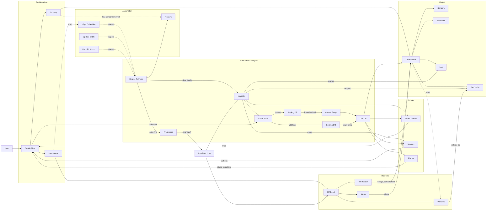

# GTFS2 Architecture

This document says where each responsibility of the fork lives, **why** it
lives there, and **which path the code takes in which case**. Every figure
quoted comes from the commit that introduced the behaviour; the commit is
named so the measurement can be found again.

It describes `refactor/architecture` as of the last commit that changed it.
A commit that adds, moves or renames a module updates this file in the same
commit.

Why the fork exists, told as the problems a user meets, is in
[WHY_FORK.md](WHY_FORK.md); the terms below, explained in plain words, in
[CONCEPTS.md](CONCEPTS.md). This file gives their exact definitions, the
figures with the commit that measured them, and the code that does it.

Contents: Context · Goals · How the fork is maintained · Overview · Layers · Glossary ·
Config entries · Services · Line labels and directions · A refresh cycle ·
Local stops · Realtime · Static feed · Write paths · Failure and recovery ·
Files on disk · Concurrency · API keys · Design decisions · Verification ·
Known gaps · Known defects

## Context: what the fork fixes

Upstream (vingerha/gtfs2) imports a feed with pygtfs into one SQLite file
per source, and that one file played two parts at once:

- **the file the sensors query**, every minute, from every entry;
- **the workspace an import rebuilds**, from scratch, in place.

Four problems came from that, each measured on real installs (WHY_FORK.md
quotes these figures):

| Problem | Measured | Commit |
|---|---|---|
| pygtfs imports the whole network, row by row, whatever the user follows | SNCF, one route kept: import 262 s → 10 s, datasource 167.8 MB → 5.9 MB | da8f4c6 |
| A refresh rebuilt the live file: sensors read a half-built database | "unknown for five minutes"; minutes to hours on a national feed | ec0881b, db_build.py |
| A refresh threw away what prune and intern had reclaimed | 259 MB back to 1.1 GB on a live install | db_build.py docstring |
| DELETE on a national `stop_times` held the database | 15 M rows: Home Assistant went unresponsive | aefaae1 |

The fork's answer, in one sentence: **keep the zip as the full record,
keep in the database only what a sensor reads, and never write the file the
sensors read.** Everything below follows from that.

## Goals and non-goals

The technical ones. The fork's principles, and what it does not try to be
(a route planner, a replacement for GTFS), are in WHY_FORK.md.

Goals:

- A sensor always reads a complete edition: the old one or the new one,
  never a mix and never a half-built file.
- The database size follows what is followed, not the size of the network.
- A failed download, import or check leaves the current data in place.
- Nothing blocking on the event loop.
- An install coming from upstream keeps its sources, keys and realtime feeds.

Non-goals:

- Replacing pygtfs. It stays the loader; the fork only decides what it is
  fed and what is kept from it (`feed/files.py`: "pygtfs is a loader, not a
  database layer").
- Querying the whole network from a database. Line lists and headsigns of
  lines never imported are read from the zip (`route_names.py`,
  `line_ends.py`, `feed/remote_zip.py`), not imported to be read. The trains of a
  feed, which the station screens search before any line is imported, are
  read from the zip too, into an index kept beside it (`stations.py`).
- Supporting Windows as a runtime. Home Assistant runs on Linux; the swap
  has a fallback for a developer's Windows box, unguarded for the few
  microseconds of the rename (`swap_in`).

Minimum Home Assistant: 2026.3 (`hacs.json`; upstream's asks 2023.10.1),
the first release that asks Python 3.14: the fork follows the Python Home
Assistant runs on now, not every one it ran on. The options flow reads
`self.config_entry` without storing it, which `OptionsFlow` provides from
2024.12 on (2024.11 has it on `OptionsFlowWithConfigEntry` only);
`entry.runtime_data` needs 2024.5.

Python: 3.14. Home Assistant's `requires_python` on PyPI asks 3.12 or
later up to 2025.1, 3.13 from 2025.2, 3.14 from 2026.3. The test workflows
run 3.14.

Libraries (`manifest.json`): pygtfs 0.1.11 or later, the one Home
Assistant's own gtfs integration pins from 2026.7 (0.1.9 before); hassfest
refuses an exact pin on a package Home Assistant depends on (36c493a).
gtfs-realtime-bindings 2.2.0: 1.0.0 predates the
trip relationships DELETED and NEW, and read a deleted trip as SCHEDULED;
3.0.0 requires protobuf 7.34 or later, while every Home Assistant release
up to 2026.9 pins protobuf lower (6.32.0 from 2026.3 to 2026.9), so
it would not install. 2.2.0 loads on protobuf 5, 6 and 7, and protobuf
itself is left to Home Assistant's pin.

## How the fork is maintained

### Branches

```
upstream/main (vingerha)
    │
    ├── feat/*, fix/*        lots: one change each, cut on upstream main,
    │                        proposable upstream as they are
    │
    ├── integration/all-lots every lot merged together, conflicts settled once
    │
    ├── ext/rt-per-source    what cannot go upstream as a lot: datasource
    │                        entries, source-level realtime, the source
    │                        refresh settings
    │
    └── refactor/architecture
                             ext/rt-per-source, reorganised into the layers
                             below; took lot fixes by port, never by merging
                             ext (e.g. 32459bb → 3c7e93b0, the removal of an
                             entry's map files, now remove_entry_geojson)
```

Since 2026-09-19 the lots, `integration/all-lots` and `ext/rt-per-source`
are frozen: new work lands on `refactor/architecture` directly.

**Upstream changes.** Since 37727f4f, which took upstream up to 07acaeb,
`upstream/main` is followed, not merged into
`refactor/architecture`. The fork no longer follows upstream's text: each
upstream change is reviewed, and taken over when it fixes something here,
written in the fork's own code. One that covers what the fork already does
another way is not taken.

Two upstream changes of September 2026, measured on the same feeds:

- d47e744 finds a train station by the start of its name
  (`stop_name LIKE 'name%'`). On the SNCF feed, 197 of the 2,819 stations
  it offers are the start of another one: Albert also matches Albertville.
  The fork matches the exact name (`stations.py`). Not taken.
- 0eb6b0a reads up to 100 rows for the departures of today and tomorrow.
  On TAO, line A leaves one stop 159 times a day, 318 over the two days.
  The fork reads both service days whole (`_route_departures_between`).
  Not taken.

A lot was kept mergeable upstream on its own. When a lot was recut on a newer
upstream main, its tests became tolerant: a promise about a reader the tree
has is checked, one about a reader it lacks is recorded as not checked
(b56fde6).

### When code is moved, and why: the refactor rule

The refactor is **not** a rewrite. It has two triggers and one constraint.

**Triggers.** Code the fork owns grew inside a file or method upstream owns,
and that is where merges collide; or one file tells more than one story
(`place_order.py` out of `places.py`, 595871f3; `db_prune.py` out of
`feed/files.py`, b1e6e745). A move that cut one story in two is undone: the
refresh steps went back into `coordinator.py` (e8aabebb), the shape
reading back into `geojson.py` (91da1bf2). The upstream-owned places are:

```
gtfs_helper.py                              "a file upstream owns"; five lots
                                            collided there (ea56837)
coordinator.py  _async_update_data          upstream's method (e843433)
sensor.py       _update_attrs               upstream's method (3f01c10)
gtfs_rt_helper.py                           upstream's realtime reader (52bbe62)
config_flow.py                              upstream's flow, split in screens
```

When a block the fork added there has a single responsibility, it moves to
a module the fork owns, and the upstream method calls it in one line where
the block stood. That is how `alerts.py`, `departure_attributes.py`,
`route_names.py`, `notifications.py`, `geojson.py`,
`source_zip.py`, `stations.py` and the `flow_*.py` screens were born.

**Constraint.** A move changes no behaviour:

- bodies are moved unchanged, apart from `self` becoming an argument;
- one module per commit, so a regression bisects to one move;
- the module that received the code does not import back into the file it
  left, where that can be avoided (e.g. `gtfs_helper imports nothing back`,
  333c76e, ee1f15e, 49cb538);
- imports orphaned by the move are dropped in the same commit;
- the commit says what was run: `tests/`, `tests_provider/`, and for the
  sensor a harness comparing attributes, state, icon, name and attribution
  on eight frozen coordinator states before and after (3f01c10).

**What is not moved.** Upstream code that the fork does not modify stays
where upstream put it, which keeps an upstream change to it easy to review
and take over: the per-import flags (`check_source_dates`, `clean_feed_info`) stay on the
journey entries
(`_JOURNEY_REFRESH_KEYS`, "kept there for upstream compatibility").

A behaviour change never rides along with a move. It gets its own commit,
before or after.

## Overview: the whole in one picture



Solid arrows carry data, dotted ones start something. Each piece is told
below: the entries in "Config entries", what source refresh runs in
"Static feed architecture" and its write paths, the coordinators in "A
refresh cycle" and "Realtime architecture", the map files in "Files on
disk".

## Overview: the layers

GTFS2 is organised in five layers, plus a few shared modules that every
layer uses:

```
┌──────────────────────────┐
│ Home Assistant layer     │  entities, coordinators, setup, services
├──────────────────────────┤
│ Config flow layer        │  screens
├──────────────────────────┤
│ Domain services layer    │  what the data means for one sensor
├──────────────────────────┤
│ Data management layer    │  the database files: built, read, written out
├──────────────────────────┤
│ Source & feed layer      │  where the data comes from
└──────────────────────────┘

  shared             const.py, key_mask.py, file_url.py, notifications.py
```

**Dependency rule.** A module imports from its own layer, from a lower
layer, and from the shared modules. It never imports from a higher layer.
The rule is an import-linter contract (`.importlinter`, CI: Imports), with
no exception. A second contract forbids any import cycle between the
modules, with no exception either. A module sits above everything it
needs: refreshing a source and importing its zip build the database, so
they are in the data layer, beside what reads it.

Both rules are about the code that runs. A type named only in the
annotations, imported under `TYPE_CHECKING`, may come from any layer:
the exports and the alerts are handed the coordinator they write for,
and say so in their signatures without importing it.

**Why these five.** The cut follows what changes together. The source layer
changes with hosts and publishers (validators, ranges, envelopes); the data
layer with SQLite and pygtfs; the domain layer with what a rider wants to
read; the flow with screens; the HA layer with Home Assistant's API. A
change in one should not reach two layers apart.

### 1. Home Assistant layer

```
__init__.py        setup, unload, remove, migrate, services
coordinator.py     GTFSUpdateCoordinator, GTFSLocalStopUpdateCoordinator
sensor.py          departure sensors, and the two diagnostic sensors of a source
update.py          update entity of a source
button.py          refresh button of a source
switch.py          realtime switch of a datasource
datasource_services.py  the update, prune and intern services, and the repair that drops one line
departure_services.py   the departures, arrivals and trip stops services
repairs.py         the fixes Settings > Repairs offers for gtfs2's issues
```

- Services are registered once, in `setup()`, not per entry. Each declares
  the fields `services.yaml` lists; extra keys still pass, for automations
  written against older field lists (5adc926).
- An entry's coordinator lives on `entry.runtime_data`. `hass.data[DOMAIN]`
  holds only what the sources share: locks, probe states, check timers, the
  bootstrap flag (b960969).
- The coordinator holds no SQL: it reads the timetable through `gtfs_helper`
  and the realtime through `gtfs_rt_helper`, has `vehicles.py` write the
  vehicle file, and hands the route, timetable and leg files to
  `exports.py`.

### 2. Config flow layer

```
config_flow.py     the flow itself, composed of the screen classes below, and the options of a journey or local stops entry
flow_source.py     SourceScreens: where the timetable comes from
flow_reload.py     ReloadScreens: load lines into a datasource, shrink it, wait for another writer
flow_journey.py    JourneyScreens: stops, more stops to get on or off at, direction, sensor name, mirror journey
flow_train.py      TrainScreens: departure and arrival stations, options (stations and lines), a sensor per line ticked
flow_options.py    OptionsScreens: realtime feeds and static refresh of a source
```

Collects input, creates datasource and journey entries, starts imports. An
import can outlive its flow window; its outcome is then told through
`notifications.py`. A source's realtime feeds and static refresh are the
same screens from its entry's **Configure** button and from the main menu,
which asks which source first and saves on it.

### 3. Domain services layer

```
alerts.py                what a service alert means for one sensor
departure_attributes.py  the departure sensor's attributes, group by group
route_names.py           the lines a feed declares, labelled for the flow
line_labels.py           what the user reads for a line: number, where it goes, mode, look-alikes told apart
line_ends.py             where a line goes: its trips' destinations, its two ends
stations.py              train entries: stations instead of stops, read before any line is imported from the trains of the zip (the rail index, <file>.zip.rail)
exports.py               which map files a refresh writes, and when
local_stops.py           the departures around a person or zone, timetable and realtime
gtfs_rt_helper.py        the realtime of one sensor: the feed trips it follows, next services, delays, alerts
vehicles.py              the vehicles of a journey, written as the map card's file
```

Functions here take values, not entities: `departure_attributes` takes the
attributes dict and what it reads, "nothing of the entity" (3f01c10).

### 4. Data management layer

```
db_build.py           an import into a scratch database, the followed lines copied, the swap
db_intern.py          stop_times keyed by integers instead of repeated id strings
db_prune.py           a datasource trimmed down to the lines it follows
gtfs_helper.py        the departure queries, and the next day a journey runs
datasource.py         a source's database as the readers open it: get_gtfs, its indexes
stop_rules.py         the SQL pieces every reader shares: who gets on or off, one place, train stations
clocks.py             a stop time in seconds and on its service day, the time zone a feed writes its times in
source_zip.py         the zip beside a datasource: fetched, kept, refreshed, imported
source_refresh.py     every refresh of a source's static feed, scheduled per mode or asked for, and the record of the edition installed
rt_window.py          when the realtime feeds are worth reading, off the timetable
gtfs_filter.py        cut a zip down to chosen routes before any import
direction_repair.py   repair trip direction_id after import
geojson.py            the files written under www/gtfs2 for a map card: names, route file and its shape out of the zip, the shapes of each run a leg file draws (kept in <file>.zip.shapes), writing
leg.py                the leg file: the ride of the next departure, and the trips listed timed stop by stop, each on its own shape
timetable.py          the timetable file: every departure over three service days
places.py             the places of a line the flow offers: origin, way, destination
place_order.py        the order a line's places are ridden in, both ways round
destination_order.py  the order the places reached from an origin are offered in
pair_direction.py     the direction an entry keeps for its two places, and its labels
feed_window.py        how long the kept timetable is good for
```

`feed/files.py` and `db_build.py` import neither pygtfs nor Home Assistant: the
scratch build is passed in as a callable (`import_routes(..., build_scratch)`), so the modules
can be tested on plain SQLite files.

### 5. Source & feed layer

```
feed/source_entries.py  the datasource entries, owning the realtime feeds and keys
feed/remote_zip.py      read a remote zip's contents, take one member out of it
feed/freshness.py       ask the host whether the feed changed, without downloading; else download it, check it, keep it with its sidecar
feed/rt_feed.py         a realtime feed read once per publication, decoded
feed/rt_local.py        one realtime feed, or a SIRI answer, downloaded to a local file
feed/files.py           the files a source is made of, the sources on disk, letting a schedule go
```

## Glossary

CONCEPTS.md explains these in plain words; here is what the code means by
them.

```
source         a GTFS feed as the integration knows it, identified by its file
               name; its url can change, the name stays
datasource     what a source becomes on disk (its zip and database) and in Home
               Assistant (its datasource entry)
edition        one version of a source's feed, named by its version label
               (Last-Modified, else ETag, else sha256 prefix, else download
               date: version_label); a refresh replaces one edition with the next
line, route    a GTFS route; the code says route, the screens say line
journey        a sensor's trip on one line, in one direction, from the stop or
               station it gets on at (or several) to the one it gets off at
               (or several); a train journey holds to its line by the line's
               code, and one with no code recorded rides every rail line
               (entry_lines)
local stops    an entry that follows a person or a zone and lists the
               departures of the stops around it
whole-feed     a source that some sensor reads across every line: a train
source         entry holding to no line code, a local stops entry, or an
               entry naming no line (source_readers). A train entry holding
               to codes reads the rail lines wearing them, whatever their
               route_id (source_train_lines)
real           <file>.sqlite, the only timetable database sensors open
scratch        <file>.import.sqlite, the raw pygtfs output of an import,
               deleted when the import ends
staging        <file>.refresh.sqlite, a complete database built or copied beside
               the real one, about to be swapped in
swap           putting a staging file in place of the real one with one rename,
               under SQLite's exclusive lock (swap_in)
prune          drop the trips of routes no entry follows, and what hangs off
               them: stop_times, frequencies, trip shapes, and the calendar of a
               service no surviving trip runs on. The routes table stays whole
               so the flow keeps offering every line
intern         replace the text keys of stop_times (trip_id, stop_id) by
               integers in gtfs2_trip_key / gtfs2_stop_key, and re-expose
               stop_times as a view, so every query keeps working unchanged
optimise       prune (when a keep set is given) then intern, in that order:
               interning first would mint keys for rows about to be deleted
struck trip    a trip the realtime feed cancels, or that skips the stop the
               entry gets on it at; it leaves the list and the next one takes
               its place
place          what the flow offers as an origin or a destination: a stop, or
               the stops of one station taken together, in the order a trip
               calls at them (places.py)
station        a train entry's end, picked by name: the feed files one record
               per platform and the same station under several ids
               (stations.py)
refresh mode   off | notify | auto, per source (see "Static feed")
window         the hours a source's realtime feeds are read, derived from its
               timetable (rt_window.py)
feed window    how long the kept timetable is good for, read from the zip:
               valid, ending (last service day within 7 days), expired or
               unknown (feed_window.py)
leg file       the ride of an entry's next departure and the trips listed
               after it, timed stop by stop, realtime included, each run on
               its own shape (leg.py)
rail index     <file>.zip.rail, the trains of a zip the station screens read,
               built once an edition (stations.py)
shapes store   <file>.zip.shapes, the shapes of the lines a leg file draws,
               kept for the zip's edition (geojson.py)
timetable file every departure of an entry over the service day under way
               and the two after it (timetable.py)
lot            a feat/ or fix/ branch cut on upstream main, one change each
```

## Config entries

Three kinds of entry, told apart in `async_setup_entry`:

```
datasource   data["kind"] == "datasource"   one per source, unique_id = gtfs2-source-<file>
local stops  data["device_tracker_id"] set  one per followed person or zone
journey      anything else                  one per sensor (bus or train)
```

**Why a datasource entry.** Realtime feeds, keys and the refresh mode belong
to a source, not to a sensor. Stored per journey, as upstream does, ten
sensors of one source carried ten copies that drifted apart (issue #180,
d771cba).

**Datasource entry.** Runs no coordinator. It carries the url and key of the
static feed (`http(s)://`, or `file://` for a zip in the folder), the
realtime feeds and their keys, the refresh mode and check
interval. Its platforms are `DATASOURCE_PLATFORMS`: the update entity and
the refresh button, the switch that silences realtime, and two diagnostic
sensors (whether realtime runs, how long the timetable is good for). It
arms the scheduled look at the source's host (`async_arm_source_check`).
At setup it also records a kept zip no download recorded
(`async_adopt_kept_zip`), and after each refresh of the source it has the
rail index of the zip read again, in the background (`refresh_rail_index`).

Datasource entries are created at every start, in the background and
idempotently, from the disk and the journey entries already there
(`async_bootstrap_datasource_entries`). Realtime options are seeded from the
most recently modified journey entry.

**Coming from upstream.** The entry `VERSION` stays upstream's (10): the
fork adds a kind of entry, it does not change the schema of the others, so
an install coming from upstream starts on its own entries. The bootstrap
creates each source's entry from the address, key and realtime feeds its
journeys hold, then takes those copies off the journeys
(`_drop_journey_copies`): a journey holds its source by name only. A return
to upstream is not kept. Minor version 3 turns the url `"na"` a source made
from a zip held into the `file://` url of that zip. Coordinators resolve
realtime through the datasource entry first and fall back on the entry's
own options, which is what a start before the bootstrap reads.

**Journey entry.** Gets a `GTFSUpdateCoordinator` and one departure sensor.
A bus journey names its line, direction and stops; a train journey names
stations and stores `route = "train"`, a marker rather than a route id,
and the code of its line (`line`, `lines`): the train screens make one
entry per line ticked. Either may get on or off at more stops or stations
on the way, picked in one list at creation or in its options and kept at
both ends (`origin_stations`, `destination_stations`): each is a
connection, got on or off at as each run allows. Each run is read where it
is first got on and last got off, never as a ride back to where it began
(`_several_stops`), and the sensor says where each one sets the rider
down (`next_departures_destination_stop_id`): a run may end at a stop on
the way, short of the destination. An entry made when the screens asked
the two ends apart keeps its lists as they are.

**Local stops entry.** Gets a `GTFSLocalStopUpdateCoordinator` and one sensor
per stop around the person or zone.

Each cycle, a coordinator asks `rt_feed_config` for its realtime settings.
An edit on the datasource entry reaches every sensor of the source within a
minute, without a reload.

## Services

Registered once, in `setup()`. Five answer with a service response
(`SupportsResponse.OPTIONAL`): `extract_departures`, `extract_arrivals`,
`extract_trip_stops`, `prune_datasource` and `intern_datasource`.

```
update_gtfs              refresh a datasource from its own url and key, or
                         from an address given this once, or create one;
                         runs the write paths above under the source's lock
update_gtfs_rt_local     download one realtime feed to a local file (trip
                         updates, vehicles, alerts, or SIRI)
update_gtfs_local_stops  reload the local stops entries of one tracker
extract_departures       a journey entry's departures today and tomorrow from
                         from_time on, plus next (the first one after the two
                         days, None when the calendar has none) and until (the
                         last service day the feed publishes)
extract_arrivals         the same rides, read at their arrival at the
                         destination (e7db903e)
extract_trip_stops       the calls of each trip a sensor lists, from its origin
                         on, "name - HH:MM:SS"
prune_datasource         drop what no entry follows; dry_run says what would go
intern_datasource        replace the text keys of stop_times by integers
```

`extract_departures` reads both service days whole, not the sensor's first
rows: a busy line has more than ten departures left today, and the ten the
sensor lists all fell on today, so "tomorrow" came back empty; and the
days were told by the departures' UTC clock, a run at 00:30 in Paris
filed under the evening before (aafc3c6). Upstream's query now stops at
100 rows and still sorts by the UTC clock (upstream 69b6091).
Without next and until, two empty lists said the same for a line that
resumes on Thursday, a line suspended and a feed that ran out (115d543).
It answers for journey entries only; a datasource or local stops entry
has no two ends and gets empty lists. `extract_trip_stops` reads the calls
off the event loop, matched by stop_id and stop_sequence (d15f022).

## Line labels and directions

What the route screen shows decides which line a sensor follows, so the
labels are built to tell lines apart, and read from the zip when the
database holds no timetable for them (`route_names.py`; the label itself in
`line_labels.py` with how look-alike lines are set apart, where a line goes
in `line_ends.py`).

```
label          the line number, then where it goes (_route_label)
where it goes  the long name; when the feed leaves it empty, the
               destinations its trips show (headsign_ends); else the two
               ends of its longest trip (_route_endpoints)
order          the way a line number is read: 2 before 10 (_natural)
```

Lines that would still read the same are set apart, in this order
(`set_lines_apart`):

- by their operator, where lines of several operators wear one label:
  IDFM's metro 1 and the bus 1 of Terres d'Envol get their agency's name
  (882e41c4);
- by their two ends, where one operator publishes several lines under one
  name: IDFM lists three "TER Centre - Val de Loire" (5449185);
- by their period of validity, where a publisher cuts its feed by period
  with one route_id per window: Brisbane lists its airport line eighteen
  times, the Dutch feed carried 46 lines twice. A line whose days are over
  is left out of a live list (f87237a).

On top, the route screen adds the mode where lines of one number run
different modes (`with_modes`, 8d190fe).

The ends are stable across rebuilds: a tie is broken by direction and
ends, never by trip id (185183a). A short name written in capitals is kept
as a destination when it names a place of the feed, NICE or PAU, while a
mission code such as UZAR is not (f777a72). Reading `stop_times.txt` for
the ends stops above 150 MB (eb98488).

**Direction repair** (`direction_repair.py`). Every query filters on
`direction_id`, and some feeds label it wrong: GVB trams 1, 7 and 17 carry
30 to 40 % of their trips under the other direction. After each import
(`source_zip.py`), each trip is tested against the
stop order of its direction and of the opposite one, compared by station,
and relabelled when it rides the opposite one (b4c89e0, 434826c). A loop
and a line whose `direction_id` carries no sense at all (GVB tram 14) are
left as published and logged. The reference order is the pattern most
trips ride, not the longest one (18c326f).

## A refresh cycle

`GTFSUpdateCoordinator._async_update_data`, every minute (`update_interval`,
fixed). Local stops entries run every minute too, but read the stops
around the tracker only every `local_stop_refresh_interval` (15 min by
default); in between they only take out the departures gone
(`_without_gone`).

```
1. source still being unpacked?        keep the previous data, flag it, stop
2. static refresh due?                 refresh_interval passed (15 min by
                                       default), or the departure shown has left
     yes:  get_next_departure            from the database, via gtfs_helper
           export_route_shape            route file, when its trip or the zip changed
           export_timetable              timetable file
           nothing left today?           next_service_date_for
     no:   keep the previous departure
3. realtime on for the source?         rt_feed_config
     rt_window_gate                    outside the window: feeds not read,
                                       vehicle file cleared
     get_rt_alerts                     alerts first, on their own
     get_rt_vehicle_positions          the vehicle file, on its own, when the
                                       source has a vehicle feed
     get_next_services                 delays of the listed trips
     drop_struck_trips                 a struck trip goes, the next takes its
                                       place; a few rounds on the same feed
   realtime off or paused:             delays and alerts emptied, never
                                       carried over from another moment
4. export_leg                          when the static ran or realtime was read
5. _read_records                       the rows the sensor describes the
                                       departure with
```

The schedule is opened by `schedule_for` and reopened only when the
database file changed: its inode, mtime and size (`_database_edition`).
Opening one is an engine plus a `create_all` over every table; every
coordinator used to do it every minute.

Step 1 relies on `check_extracting`: a `.sqlite-journal` beside the
database, something writing to it (a `_temp.zip` left by an older version
no longer counts: nothing writes one now). The flag is cleared once the reuse branch is reached,
so a transient journal no longer blanks the sensors for a whole refresh
interval (01587fd).

### Local stops

A local stops entry follows a person or a zone (`device_tracker_id`) and
gets one sensor per stop near it, from `GTFSLocalStopUpdateCoordinator`, every
minute: the stops are read again every `local_stop_refresh_interval`
minutes (15 by default), or at once when the database changed, and in
between the departures gone are taken out. Its departures are read in
`local_stops.py`.

```
position       the tracker's coordinates; no tracker, or none yet: no
               stop, no error (e9d3bc0)
stops          within a box of radius metres around it (200 by default),
               turned into degrees at 111,111 m each
departures     from now minus timerange_history to now plus timerange
               (15 and 30 minutes by default), every line
realtime       trip updates only, matched by trip, from the download the
               source's other sensors share; the vehicle feed is not
               read, since the entry speaks for no line
```

The options screen refuses to save a radius that holds more stops than
the entry's own limit (`max_local_stops`, 15 by default; fb4af02);
the setup screen, which takes the default radius, does not count them. A realtime feed that fails
leaves the timetable standing, without delays (e35fe88). An entry set up
while its source is still unpacking has no stops to create yet: its
platform answers "not ready" and Home Assistant retries it. The retry
refreshes the coordinator with `async_refresh`, since Home Assistant
refuses a first refresh once the entry is loaded (1fe6d7e).

## Realtime architecture

```
feed/source_entries.py  urls and keys of the source's feeds
        ↓
rt_window.py            rt_window_gate: is this a time the feeds are read?
        ↓
feed/rt_feed.py         get_gtfs_feed_entities: one download per publication
        ↓
gtfs_rt_helper.py       get_next_services, get_rt_alerts
        ↓
alerts.py
        ↓
coordinator.py          drop_struck_trips
        ↓
sensor.py
```

**The window.** Per source and service day, feeds are read from the first
passage of the day minus 10 minutes to the last plus 20. GTFS hours pass
24, so yesterday's window is always tested beside today's. A day without
service reads nothing. At the close, the window stretches by 10 minutes per
re-check while the last fetch still announces a future stop for a followed
line, capped two hours past the close: a late vehicle is when realtime
matters most. That last fetch lives in memory: after a restart past the
close, within the cap, the feed is read once, and the stretch carries on
from what it says (7fd9c287). Why derive it: the integration owns the timetable, so nobody
has to write an automation, and episodic lines stop being polled (TAO's 22
runs 122 days a year).

**Outages.** A feed failure is logged when it is new for its url, at debug
while it lasts, and its recovery once at info (be807b9): every entry of a
source reads the feeds every minute, and used to log the same error each
time.

`gtfs_rt_helper.py` reads the alert feed, `alerts.py` decides what one
alert means for the entry.

### What realtime changes on a sensor

**Struck trips.** A trip the feed marks CANCELED or DELETED, and a call
marked SKIPPED at the stop the entry gets on that trip at, is no
departure: a board can list trips boarded at different stops of one place,
or at the more stops an entry gets on at (bb25a206). The board moves on:
the departures are read again from the rows of the last static refresh
without that trip, a few rounds at most on the feed already read, so the
next departure shown is the next one that runs,
with its own arrival, headsign and duration. A call marked NO_DATA gives
no realtime time either. A trip is struck on the service day the feed
names, since a trip cancelled today runs tomorrow under the same id.
Measured on 2026-09-15: the Dutch feed cancelled 18 % of the trips of the
hour and skipped 38 % of the calls (f8fc54c).

**Which alerts concern a journey** (`alerts.py`). The fields of one
`informed_entity` hold together, as the specification reads them: "this
trip at this stop" is about that trip alone, and an agency, a kind of
line or a direction other than the journey's make the entity about
something else (531478e, c716515). A stop matches through its station too,
since feeds derived from NeTEx publish a station and its platforms as
separate stops. A trip matches in the truncated form SNCF uses in its
alerts (`_same_trip`).

**Which alert is shown.** An alert names the departures of the board it
concerns, the next one and those listed behind it (d2afc3a). The alerts
of one end are ranked worst effect first, the ones to come after the
current ones, and five are kept (`_rank_alerts`). Each carries its periods
(66b4f66). The sentence of the sensor is taken from an alert that applies
now and concerns the departure shown: one for a day to come, or one that
names only a later departure of the board, stays in the list, never in
the sentence.

## Static feed architecture

Two separate paths: one fills the database, the other reads it.

```
Filling                              Reading

freshness.py   changed?              coordinator.py
     ↓                                    ↓
source_zip.py  fetch, keep the zip   gtfs_helper.py   get_next_departure
     ↓                                    ↓
gtfs_filter.py keep chosen routes    <file>.sqlite
     ↓
db_build.py    build, swap
     ↓
<file>.sqlite
```

The map files and the train screens take a third way, through the kept
zip: the route file reads its shape straight from it (`read_shape`), the
leg files read theirs through `<file>.zip.shapes` (`route_shapes`), and
the train screens read the trains through `<file>.zip.rail`
(`rail_index`).

### Refresh modes: when a source is looked at

Chosen per source on the datasource entry (`source_refresh.py`):

```
off      nothing runs by itself; the button and the update service still
         refresh on demand. The update entity claims no version beyond the
         installed one, so it has nothing to install, and asking it to
         check for an update does nothing
notify   one conditional request per check; on a new edition the update
         entity turns "update available" and, once per version, the event
         gtfs2_source_update_available fires, so an automation can install
         in a window that suits the install
auto     same check, and the rebuild runs at the first check that finds a
         change
```

Every source is checked, a zip in the gtfs2 folder too: it is fetched by
its `file://` url, which `file_url.py` answers as a host would, the file's
own time standing for Last-Modified.

**When.** The user picks a frequency (1 to 360 hours, 24 by default), never
a moment. Each source gets its own night slot between 03:00 and 05:59
local, derived from a hash of its file name: stable across restarts, and
sources never rebuild on the same minute. A sub-daily frequency adds passes
spaced from that anchor, so one always lands at night. A source whose last
look is overdue is caught up 10 minutes after start, past the start-up rush.

**Whether.** `probe_source` sends one conditional request built from the zip
sidecar's validators and answers unchanged, changed, unknown (the host
publishes no validators) or error. Eleven of thirteen hosts probed in
September 2026 answer 304 (550b187). On changed or unknown, the verdict is
not trusted alone: some hosts stamp a fresh Last-Modified on every answer,
so `fetch_if_new` downloads and lets the sha256 decide.

### Envelope sources: one zip, several networks

Some publishers answer one zip that holds a zip per network: SEPTA's
`gtfs_public.zip` carries `google_bus.zip` and `google_rail.zip`. Imported
as it is, no reader finds a `routes.txt`, and the flow failed three screens
later on "no routes with trips" (99dfa42).

```
source screen      remote_zip reads the url's table of contents with two
                   ranged requests (the last 64 KB, then the directory)
                   and the flow asks which network to follow
download           only that member, by its own byte range: 823 KB of a
                   21.7 MB envelope on SEPTA (99dfa42)
datasource entry   keeps the pick (inner_zip)
every refresh      asks for that member again, never for the envelope
```

A host that ignores ranges answers 200 with the whole file. The download
then takes the envelope whole and the member out of it before the feed is
checked, so the zip on disk and the hash in its sidecar are the same
whichever way it arrived. On the source screen, where nothing is picked
yet, such an envelope is kept and its networks are offered from the file.
A zip the user dropped in the folder goes through the same screen.

What comes from the remote file is bounded, since its sizes are the
host's word: a directory above 16 MB is not read, a member taken out
stops at 2 GiB like a download, and a member is inflated a chunk at a
time, never whole in memory.

### Choosing a write path

Four paths write a database. They differ because what they risk differs.

| Trigger | Path | Builds on | Swap | Why this path |
|---|---|---|---|---|
| User picks lines on the route screen | `import_routes` | scratch → real, per line | No | Append-only: existing rows are never touched, so there is nothing a reader could see half-changed. Keys are minted in the real database during the copy, so there is never a second set to remap. A new database whose scratch holds only those lines is that file, renamed |
| New edition (check in auto mode, update entity, button, `update_gtfs` service) | `refresh_datasource` | staging, built route by route | Yes | Every row may change; readers must see one edition or the other |
| Same, on a whole-feed source, or one that follows no line and whose sensors name none (never built, or left empty by a first import) | `_refresh_whole_feed` | staging, the filtered import itself | Yes | A local stops sensor, or a train sensor holding to no code, matches across every line, and a line the new edition brings must come in too; taking the lines from the old database never brought new ones. A source with no line has nothing to take them from. A database deleted or left empty under line sensors takes their lines back route by route instead |
| Optimise screen, `prune_datasource`, `intern_datasource` | `on_a_copy` | staging, a SQLite backup of the real one | Only if something changed | Destructive rewrites by the million plus VACUUM: on the live file they held the exclusive lock for minutes on a national feed |

**Filtering before import, not pruning after.** pygtfs pays per row: once
the whole feed is imported, the time and the disk are already spent. The
zip is cut down to the chosen routes first (`gtfs_filter.py`), written
beside the source and never into it; `routes.txt` and `agency.txt` are
copied whole so the flow keeps offering every line. When the filter cannot
run, the feed is imported whole: "slower, never wrong" (da8f4c6). On
gtfs-nl.zip, 15.1 M stop_times are filtered in 40 s to a feed pygtfs
imports in half a second, where the full import built a 2.6 GB scratch file
(`build_scratch_database`).

**Why the scratch database stays raw.** Interning it too would mean two sets
of integer keys to reconcile, and keys are local to a file: a second import
measured 31 stop keys already taken (`db_build.py`).

#### Adding lines (`import_routes`)

```
scratch left by an interrupted run?   discarded first: unknown state
    ↓
zip filtered to the lines (gtfs_filter)
    ↓
scratch database (build_scratch_database), then indexed by route
    ↓
no real database yet, and the scratch holds only the lines asked?
    the scratch is renamed into place, nothing copied (take_scratch_whole)
    ↓
else: real database created from the scratch schema, if there is none,
    then copy_route(), one transaction per line, straight into it;
    network-wide tables copied with the first line only
    ↓
scratch deleted, whatever happened
```

A database the flow's import created is recorded as built from the kept
zip (`record_installed`, 7062841b), as a refresh records it: the update
entity then says which edition is installed rather than assuming it from
the zip.

Indexing the scratch file by route took the copy of 41 Orleans routes from
206 s to 16 s, for 9 s of indexing.

#### Refreshing a source (`refresh_datasource`)

```
real database unreadable?             stop, keep the data (see below)
real database follows no route?       the lines its sensors read (read_routes),
                                      or the whole edition, below, when they
                                      name none or one reads the whole feed
    ↓
new zip downloaded to <file>.zip.new, streamed, capped in size and time,
    adopted only once proven a zip
    ↓
check_source_dates set and only future dates?   stop, keep the data
    ↓
train sensors holding to codes?       the rail lines of the new edition
                                      wearing them come in too, a route_id
                                      the database never had included; a
                                      code with no line left: stop, keep
                                      the data (_with_train_lines)
    ↓
<file>.refresh.sqlite built beside the real one:
    import_routes of the followed lines, or the whole edition
    ↓
checked (see the table below)
    ↓
optimise_datasource()   intern only: everything was copied on purpose
    ↓
swap_in()               one rename over the real database
```

`routes_in` answers `None` for a file it could not read and an empty set for
a file with no trip, or no file. The two must stay apart: read as "follows
nothing", an unreadable database would be rebuilt whole over the data it
still holds.

#### Shrinking a datasource (`on_a_copy`)

```
SQLite backup of the real database into <file>.refresh.sqlite
    ↓
the work, on the copy:
    optimise screen    optimise_datasource(): prune what is not followed, then intern
    prune service      prune_gtfs_datasource()
    intern service     intern_gtfs_datasource()
    ↓
swap_in(), only when the work changed something
```

Prune rebuilds each table from its own DDL rather than DELETE: DELETE pays
per row removed, a rebuild per row kept, which is the small side. Services
to keep are collected once into a keyed temp table; reaching through
`trips` instead did not come back within ten minutes on SNCF (aefaae1).

Prune refuses rather than lose data: an empty keep set, a keep set that
matches no trip, and the `"train"` marker, which needs every route kept.

## Failure and recovery

What each failure leaves, and who is told. A failure that lasts is a
repairs issue in Settings > Repairs, which goes away with its cause; the
report of an import the user started is a notification.

| Failure | Data after | User is told | Retry |
|---|---|---|---|
| Download fails or is not a zip | Old zip and database untouched; `.zip.new` removed | Refresh failed issue, its fix retries now | Next check |
| Import of the scratch fails | Old database untouched | Refresh failed issue, its fix retries now | Next check |
| Adding lines stops at line *k* | Lines before *k* are in; *k* and after are not | The partial import notification names the lines that came in and the ones that did not; a flow still open says the same on its departure screen | User re-picks |
| Refresh: a line fails to copy | Swap refused, old database stays | Refresh failed issue, its fix retries now | Next check |
| Refresh: a line a sensor reads has no trip in the new edition, or a train sensor's code no line with a trip | Swap refused, old database stays, on the route by route and the whole-feed path alike | Lines missing issue, naming them | Next check; see below |
| Refresh: every line is empty | Swap refused, the file is taken as broken | Lines missing, every line named; on the whole-feed path, refresh failed issue | Next check |
| Refresh: a line nobody reads has no trip | That line is dropped, the swap goes through | Nothing | — |
| Swap cannot take the exclusive lock within 30 s | Old database stays, staging removed | Refresh failed issue, its fix retries now | Next check |
| Rebuild fails after the zip was adopted | Zip ahead of database (`rebuild_pending`) | Refresh failed issue, its fix retries now | Next auto check rebuilds from the kept zip first; refused again, it goes on to ask the host for a newer edition |
| Optimise screen: the copy or its swap fails | Old database stays | The screen says it failed (`generic_failure`), not "space freed" | User runs it again |
| Envelope source: the network picked is gone from a new edition | Old zip and database untouched: the envelope alone is refused as no feed | Refresh failed issue, its fix retries now | Next check, until the publisher brings the network back |
| Refresh succeeds | New edition | Earlier failure issue cleared | — |

**Why `rebuild_pending` exists.** The zip is adopted before the build. If the
build fails, the host asked with the zip's own validators answers
"unchanged", and the source would never be built again. The two sidecars
say it instead: the zip's records what was downloaded, the database's what
it was built from. A kept zip whose build is refused (a followed line
missing, a broken edition) would fail the same way every night, so after
that refusal the check asks the host anyway: only a newer edition can get
the source moving again.

**A line retired for good.** When the operator really removes a line a
sensor reads, the refresh is refused at every check and the source stays on
an edition that will run out. The issue names the line; the user
removes or re-targets its sensor, after which the line is no longer read
and the refresh goes through. `feed_window.py` and the diagnostic sensor
say how long the kept timetable is still good for.

**Why the swap gives up after 30 s.** Long enough for an index or an
intern, short enough not to hold the refresh behind a VACUUM of several
minutes (`SWAP_TIMEOUT`).

### After a restart or a crash

Nothing needs a recovery pass at start; each path clears what an
interrupted run of itself left before it begins:

```
<file>.import.sqlite      discarded at the start and end of every import_routes
                          (<file>.refresh.import.sqlite in a refresh route by route)
<file>.refresh.sqlite     removed at the start and end of every refresh and on_a_copy
<file>.zip.new            overwritten by the next download
hot journal on the real   rolled back by SQLite when the next swap takes the
database                  exclusive lock, before the rename
zip ahead of database     rebuild_pending, read at the next check
```

One step does run at each source's setup: a kept zip with no sidecar, as
an install coming from upstream leaves it, gets one written from the file
(`adopt_kept_zip`, d71b4b8b).

Locks and the host's last answer are in memory on purpose: they are
re-derivable at the next tick. Only the time of the last look is kept, in
the zip's sidecar (`checked_at`), so the catch-up after a start knows
whether the night's check ran. Until the first check, the update entity
claims the installed version, or the zip's when the zip is ahead of the
database, never "unknown".

## Files on disk

Everything a source owns sits in the `gtfs2` folder of the Home Assistant
configuration, named after the source's file:

```
gtfs2/
  <file>.zip                  the feed as downloaded, the only full record of it
  <file>.zip.meta.json        what the host said of that zip (final url, ETag,
                              Last-Modified), its sha256, size and dates; for
                              a zip found with no record, only its hash, size
                              and file time
  <file>.zip.rail             the rail index: the trains of that zip, for the
                              train screens, stamped with its edition
  <file>.zip.shapes           the shapes of the lines the leg files asked for,
                              for that edition
  <file>.sqlite               the real database, the only timetable database
                              sensors open
  <file>.sqlite.meta.json     which edition the database was built from

  while something runs, removed when it ends or by the next run:
  <file>.zip.new              a download, adopted once proven a zip
  <file>.zip.new.inner        the network taken out of an envelope download
  <file>.zip.rail.new         the rail index being written
  <file>.import.sqlite        the scratch database of an import
  <file>.import.sqlite.zip    the zip cut down to the chosen lines
  <file>.refresh.sqlite       a rebuild or a copy about to be swapped in
  *-journal                   SQLite rollback journal
  *-wal, *-shm                never created by the integration (see
                              "Concurrency"), removed defensively
```

Both sidecars, the rail index and the shapes store are disposable caches:
a sidecar costs one refresh at most, the other two are read again from
the zip.
The staging and scratch files live beside the real one so a rename never
crosses a device boundary.

Map files go to `www/gtfs2/`, served to the cards as `/local/gtfs2/`:

```
www/gtfs2/
  <source>_<route>_<direction>_route.json  the line, drawn from its fullest trip
  <source>_<route>_<direction>.json        the vehicles, from the realtime positions
  <route>_<direction>_leg_<name>.json      the next departure's ride, and the
                                           trips listed with their stops and shapes
  timetable_<name>.json                    an entry's departures over the next days
```

The route and vehicle files are also written under the names they had
before, without the source, for what reads them by url (`map_file_names`,
d30b2cf2); the source is not repeated where the line id already starts
with it.

The vehicle file holds the vehicles on a trip whose position is recent:
some feeds keep publishing the vehicles gone back to the depot under
their last trip. Older than the source's limit (`vehicle_max_age` on its
realtime screen, 10 minutes, 0 for no limit) a position is left out; one
with no timestamp stays, a feed served as json may give none.

`www/` is not where an integration usually writes. It is the one place a
card can read a file from without a custom HTTP view, which the fork does
not want to maintain. Each file is written beside its target and renamed,
so a card never reads half a file. Removing a datasource removes its
`gtfs2/` files, under its lock and off the loop. Removing an entry removes
its own leg and timetable files, and the route and vehicle files of its
line once no other entry needs them: the source's own names with the
source's last entry on the line, the names without a source with the
last entry of any source; for a train entry, the lines are read
back from the database: the trips between its two stations (0be7d37).
When the removed entry was the last to read its line, the line's timetable
stays in the source (a prune never runs by itself) and a repairs issue
names it; its fix drops that line alone, and a sensor reading the line
again clears it.

An entry's own files are named after the entry, folded to a file name:
accents dropped, case and punctuation folded, "Orléans" reads `orleans`.
Two names that fold to the same part would share their files, so the flow
refuses a name whose part another entry uses (642864a). The removal finds
a leg file by the ending the entry's name gives it, and checks that what
comes before that ending is a line id: a name such as "Tram 1 leg Centre"
ends the way "Centre" does, and its file is not Centre's to remove
(0be7d37). A leg file of the entry's earlier line goes when a new one is
written (6ce772e).

## Concurrency

Writers: the automatic refresh, the button, the update entity and service,
a line added from the route screen, the optimise screen, the prune and
intern services, the repair that drops one line, the removal of a
datasource. Readers: one coordinator per
entry, every minute. Three rules keep them apart.

**One writer per source.** Every writer takes `source_lock(hass, file)`, one
`asyncio.Lock` per source. A refresh never runs beside an import of the same
source, which would otherwise take the lines just added with it. The update
entity, the button, the scheduled check, the prune and intern services and
the re-reading of a source's rail index read the lock, to show a rebuild
in progress or step aside, without waiting on it. The scheduled check's
own download, which can last half an hour and writes the same
`<file>.zip.new` a refresh stages into, runs under the lock too. A second
refresh arriving while one runs is dropped, not queued.

**Readers never see a file being written.** Writers build on a copy
(`.import`, `.refresh`) and `swap_in` puts it in place with one rename.
A rename is invisible to SQLite: a writer still in a transaction on the old
file would go on writing, and its journal, replayed against the new file,
would take it back to the old contents. So the rename happens while
holding SQLite's own exclusive lock, which every connection respects
whatever process it runs in. Side files
named after the real file are removed right after, so the next reader does
not replay the old file's journal into the new one.

The integration runs SQLite in its default rollback-journal mode and never
enables WAL; this is what makes the exclusive lock sufficient. Enabling WAL
would require revisiting `swap_in`.

Coordinators notice a swap through `_database_edition` and reopen the
schedule on their next cycle. Until then they keep the one already open,
which on Linux keeps reading the unlinked old file: complete, just old.

Connections wait for a busy database rather than fail: 60 s for readers
and copies (ea9ff2f: at start, entries opening one large database at once
gave up at the 5 s default and their sensors were never created), 300 s
for prune and intern; the swap waits 30 s for its exclusive lock.

**Nothing blocking on the event loop.** SQLite, pygtfs, zip reading and file
writes go through `hass.async_add_executor_job`. The lock is taken on the
loop and the work runs in the executor under it.

## API keys

A key is typed once and then travels far: in the url when it rides in the
query string, in headers, in the dicts debug lines print, and in the
exceptions `requests` raises, which quote the full url (`key_mask.py`,
bb4f8f6).

- A key goes in the url (`with_query_key`), in a header under its name,
  or as an HTTP Basic login the integration encodes, `Authorization:
  Basic base64("key:")`, or the key as it is when it holds a user:password
  (`key_headers` in `feed/source_entries.py`, `basic_credentials` in `key_mask.py`). The static zip
  and the realtime feeds ask with the same two functions.
- One logging filter sits on the logger of every module of the
  integration and writes `*****` wherever a known key shows, raw,
  percent-encoded or base64-encoded, tracebacks included. Keys are known
  from the entries at setup and from the flow and service calls on
  arrival. Guarding each log line one by one would miss the next one
  written.
- The flow's key screens give a stored key back in a password field:
  hidden on screen, shown on demand by the field's own eye.
- A url that carries a key is masked before it is stored or shown: the zip
  sidecar and the update entity's `source_url` and `configured_url`.
- A key sent in a header goes to the host it was given for. `requests`
  drops only `Authorization` on a redirect to another host; `fetch` drops
  every header the caller gave, `User-Agent` and `Accept` apart (e0150bf).

## Design decisions

Each decision, why, and what was rejected. The principles behind them are
in WHY_FORK.md; atomic rebuilds are the first goal above, why a source owns
its configuration is told under "Config entries".

**The zip is the source of truth.** The database can be rebuilt from the zip
at any time; shapes are read from the zip and never imported. A download
never replaces the zip before proving to be one: a moved url often keeps
answering 200 with an error page (550b187). Rejected: importing shapes,
which is most of a feed's size for one map line.

**Two databases, not one.** The file the sensors read is never the file an
import writes. Rejected: importing in place then pruning, which throws away
the pruning at each refresh and shows readers a half-built file.

**Adding lines does not swap.** It only appends, one transaction per line.
Building a full copy for each added line would cost the time and disk of
the whole database for a change that touches none of its existing rows.

**Business logic stays outside entities.** Entities read what the domain
layer computed; the domain layer takes values, not entities, so it can be
tested without Home Assistant.

## Verification

```
tests/            synthetic tests, run under the Home Assistant stub kept
                  in tests/, no install needed   CI: Synthetic Tests
tests_provider/   tests on real provider feeds; results.json records which
                  promises hold, xfail marks the known failures, strict
                  so a fixed case must drop its mark  CI: Provider Tests
both suites       branch coverage, may not fall under a floor (84%)
                                                  CI: Coverage
complexity        each function at 10 or under, or at its recorded
                  ceiling (.github/complexity.json), which only comes
                  down; no pyflakes finding       CI: Complexity
layers            the import-linter contracts (.importlinter): no
                  import from a higher layer, no import cycle
                                                  CI: Imports
types             what a function takes and returns, in its signature,
                  checked by mypy in every module (mypy.ini)
                                                  CI: Types
hassfest, HACS    manifest, strings, services     CI: Validate
```

A refactor commit states which suites it ran and their counts. A change of
behaviour comes with the case that shows it.

The Home Assistant stub in tests/ stands in for the entity and flow classes,
so `sensor.py` and the config flow are tested too: the sensor attributes
against an approval file (`tests_provider/expected/`), the config flow
walked screen by screen on the provider feeds. Home Assistant's own
behaviour is read from its source, never assumed. For instance a first
refresh outside setup raises `ConfigEntryError` (read in 2026.2.3), so a
local stops platform retried after `PlatformNotReady` (1fe6d7e) finds its
coordinator already filled and refreshes it plainly (b960969).

## Known gaps

What the code does not follow yet from the design above: none. A gap is
closed when the rule it breaks can be checked by a test.

The last three closed on 2026-09-29 (e03e4f8f). `gtfs_helper.py` and
`gtfs_rt_helper.py`, upstream's two files that every layer imported, sat
outside the layers while the fork's code left them (the stops around a
person, the places of a line, the timetable services, the flow's lists,
the sources on disk); what stayed is a data layer module (the departure
queries and their SQL pieces) and a domain one (the realtime of a
sensor), once the few functions a lower layer needed went down: the file
name and json writing to `geojson.py`, the feed's route id match, stop
clock and service day to `rt_feed.py`, the cache check to `rt_window.py`,
`close_schedule` to `feed/files.py`. The import contract, which listed the
imports of the gaps as its exceptions, has none left.

## Known defects

Wrong behaviours a user can meet, confirmed in the code and not fixed yet.
Unlike the gaps, they are not a matter of structure: each is to be fixed
in a commit of its own, with the case that shows it.

None is open.
